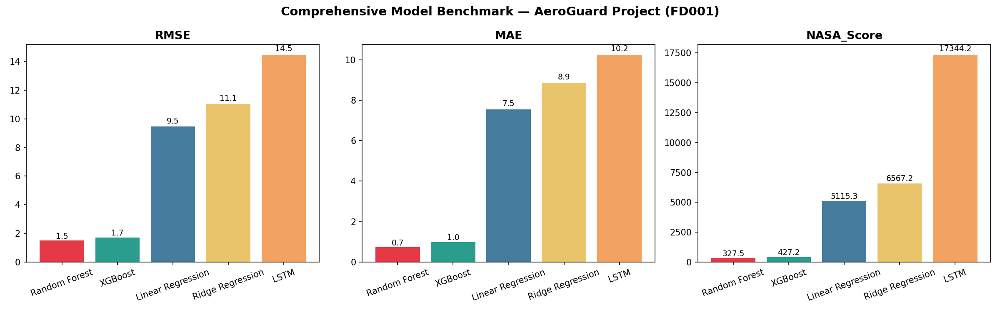
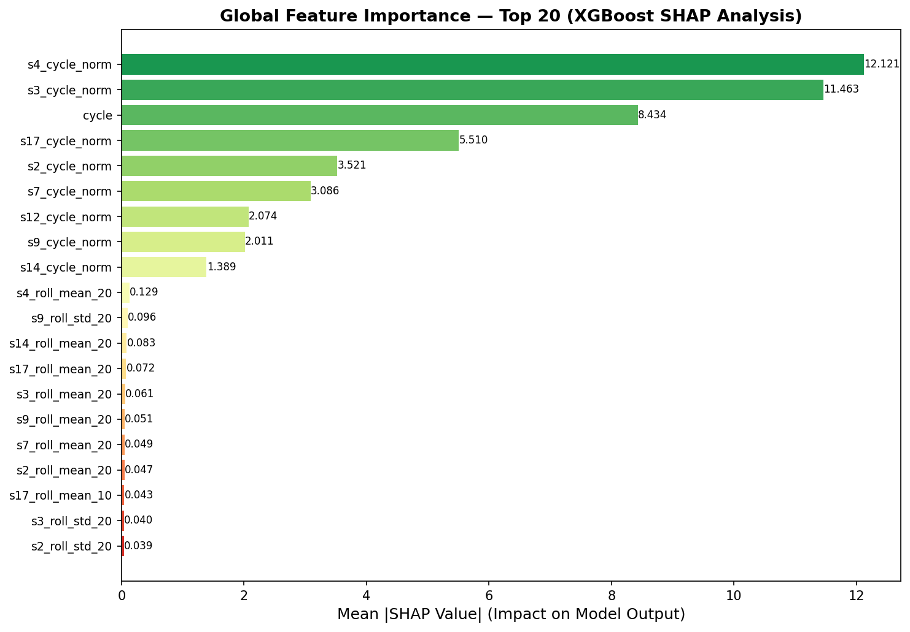
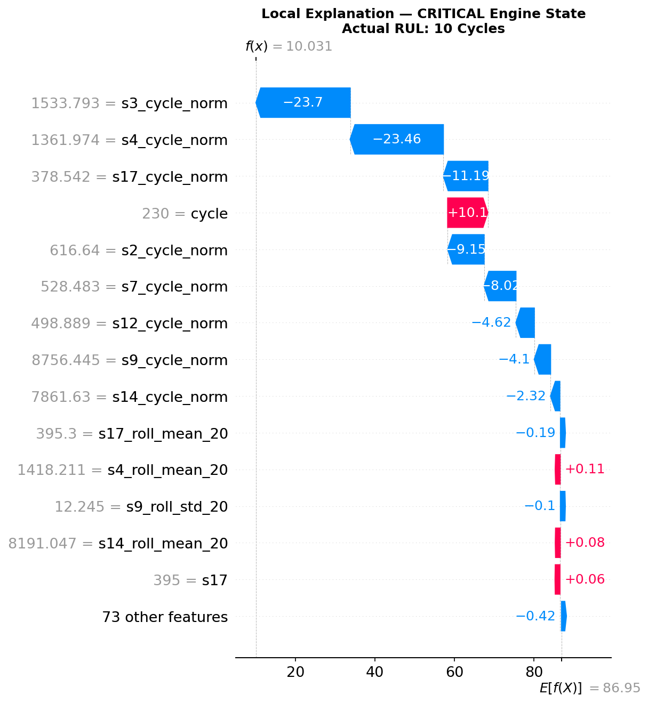
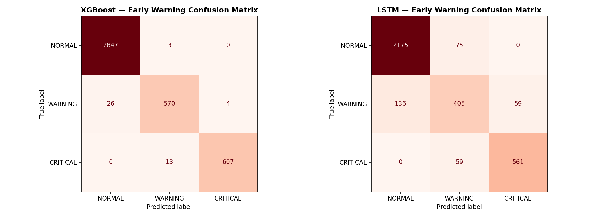
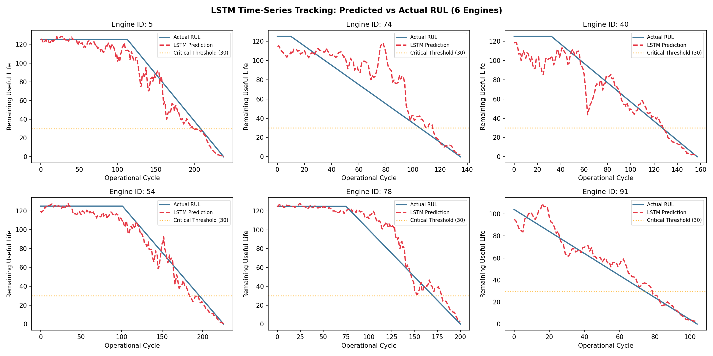

# AeroGuard — Predictive Maintenance for Aircraft Engines

AeroGuard is an end-to-end predictive maintenance pipeline built on the NASA CMAPSS dataset. The goal is straightforward: given a turbofan engine's sensor history, predict how many operational cycles it has left before failure. Every design decision in this project, from feature engineering to model selection, was made with that single objective in mind.

---

## What This Project Does

Aircraft engines degrade gradually. Sensors capture that degradation, but raw sensor readings are noisy and hard to interpret directly. AeroGuard takes those 21 raw sensor streams, extracts meaningful temporal features, trains multiple models to predict Remaining Useful Life (RUL), and then wraps the best predictions into an actionable three-tier alert system: Critical, Warning, and Normal.

The pipeline covers the full ML lifecycle: exploratory analysis, feature engineering, baseline benchmarking, deep learning, explainability, and operational alerting.

---

## Dataset

I used the **NASA CMAPSS (Commercial Modular Aero-Propulsion System Simulation)** dataset, starting with the FD001 subset.

- 100 training engines, each run to failure
- 21 sensor readings per operational cycle
- 3 operational settings captured alongside sensor data
- Target variable: Remaining Useful Life (cycles until failure)

FD001 has a single fault mode and a single operating condition, making it the cleanest starting point. The same pipeline extends to FD002, FD003, and FD004 for multi-condition and multi-fault scenarios.

---

## Project Structure

```
AeroGuard/
├── notebooks/
│   ├── 01_EDA.ipynb
│   ├── 02_feature_engineering.ipynb
│   ├── 03_baseline_models.ipynb
│   ├── 04_xgboost_shap.ipynb
│   ├── 05_lstm.ipynb
│   ├── 06_early_warning.ipynb
│   └── 07_visualizations.ipynb
├── src/
│   ├── __init__.py
│   ├── data_loader.py
│   ├── features.py
│   ├── models.py
│   └── evaluate.py
├── results/
│   ├── benchmark_table.csv
│   ├── benchmark_final.png
│   ├── shap_top20_features.png
│   ├── shap_waterfall_crit.png
│   ├── confusion_matrix.png
│   └── lstm_predictions.png
├── requirements.txt
└── README.md
```

---

## Pipeline

**Step 1 — EDA**
I started by profiling all 21 sensors across the full engine fleet. Several sensors showed near-zero variance throughout an engine's lifetime and were dropped. Operating conditions were clustered using KMeans, and I visualized per-sensor degradation curves to identify which signals carry meaningful failure information.

**Step 2 — Feature Engineering**
Rather than feeding raw sensor values into the models, I engineered temporal features: rolling means and standard deviations over 5, 10, and 20-cycle windows, cycle-normalized sensor values, and cross-sensor interaction terms. This step is where most of the predictive signal comes from, and it is what separates this project from a straightforward regression on raw readings.

**Step 3 — RUL Labeling and Baseline Models**
I used a piecewise linear RUL formulation: RUL stays constant at a maximum value during the healthy early phase of an engine's life, then decreases linearly as the engine approaches failure. This is more realistic than a straight linear decay from day one. I then trained Linear Regression, Ridge Regression, Random Forest, and XGBoost on this labeled dataset.

**Step 4 — XGBoost and SHAP**
XGBoost was the strongest classical ML model. I applied SHAP TreeExplainer to interpret its predictions globally (which sensors matter most across the fleet) and locally (why a specific engine received a high-risk score). The waterfall charts make individual predictions auditable.

**Step 5 — LSTM**
I built a stacked LSTM network fed via a 30-cycle sliding window. The architecture uses two LSTM layers with batch normalization and dropout, trained with Huber loss to handle RUL outliers. Early stopping and learning rate scheduling are in place to prevent overfitting.

**Step 6 — Early Warning System**
Raw RUL predictions are mapped to three operational alert levels. The system outputs a classification label for each engine at each cycle, alongside confusion matrices and precision-recall curves for the Critical class.

**Step 7 — Interactive Visualizations**
All key outputs are rendered as interactive Plotly charts: degradation curves with predicted vs. true RUL, the full benchmark comparison table, SHAP feature importance, and a fleet-level overview showing every test engine's final predicted alert status.

---

## Benchmark Results (FD001)

| Model             | RMSE  | MAE   | NASA Score |
| ----------------- | ----- | ----- | ---------- |
| Random Forest     | 1.50  | 0.74  | 327.5      |
| XGBoost           | 1.72  | 0.99  | 427.2      |
| Linear Regression | 9.46  | 7.55  | 5115.3     |
| Ridge Regression  | 11.05 | 8.86  | 6567.2     |
| LSTM              | 14.47 | 10.24 | 17344.2    |

The NASA Score is an asymmetric loss function that penalizes late predictions more heavily than early ones, reflecting the real operational cost of missing an imminent failure. Lower is better.

> Note: LSTM underperformed on FD001 due to the dataset's limited size (100 engines). LSTMs typically gain their advantage on larger multi-condition datasets such as FD002 and FD004, where temporal patterns across varying operating conditions are harder for tree-based models to capture.



---

## SHAP Explainability

XGBoost model interpreted via SHAP TreeExplainer:

- **Global**: which sensors drive RUL predictions across all engines
- **Local**: waterfall chart per engine — why a specific engine is flagged as critical
- **Summary plot**: feature impact distribution across the test set

The chart below shows the top 20 features ranked by mean absolute SHAP value. Rolling standard deviation features dominate, confirming that the rate of change in sensor readings is more predictive than the readings themselves.



The waterfall chart below breaks down a single engine's prediction, showing exactly which features pushed the RUL estimate up or down from the model's baseline.



---

## Early Warning System

RUL predictions are mapped to three operational alert levels:

| Alert    | RUL Threshold       | Recommended Action    |
| -------- | ------------------- | --------------------- |
| CRITICAL | Less than 30 cycles | Immediate maintenance |
| WARNING  | 30 to 60 cycles     | Schedule inspection   |
| NORMAL   | More than 60 cycles | Continue operation    |

The confusion matrix below shows how accurately the system classifies each alert zone. Misclassifications between WARNING and CRITICAL are far more costly than NORMAL misclassifications, and the NASA Score used during training reflects this asymmetry.



---

## LSTM Predictions

The chart below compares LSTM-predicted RUL against ground truth for a sample of test engines. The shaded zones indicate alert regions.



---

## Key Design Decisions

**Piecewise linear RUL.** A straight linear decay from the first cycle assumes the engine is already degrading at cycle one. In reality, engines operate in a healthy regime for a significant portion of their life before degradation accelerates. Capping RUL at 125 and holding it constant until the degradation phase begins produced meaningfully stronger models.

**Sensor filtering.** Five sensors with near-zero variance were removed before any modeling. Keeping them would add noise without contributing signal.

**Huber loss for LSTM.** RUL distributions have outliers. Huber loss is less sensitive to those outliers than MSE while still penalizing large errors more than MAE.

**Asymmetric evaluation.** Standard RMSE and MAE do not capture the operational asymmetry between early and late failure predictions. The NASA Score is included in every model evaluation for this reason.

---

## Setup

```bash
git clone https://github.com/burakkeynz/AeroGuard.git
cd AeroGuard
pip install -r requirements.txt
```

Download the NASA CMAPSS dataset and place the raw files in `data/raw/`. The dataset is available through the [NASA Prognostics Data Repository](https://www.nasa.gov/intelligent-systems-division/discovery-and-systems-health/pcoe/pcoe-data-set-repository/).

Run notebooks in order from 01 through 07.
